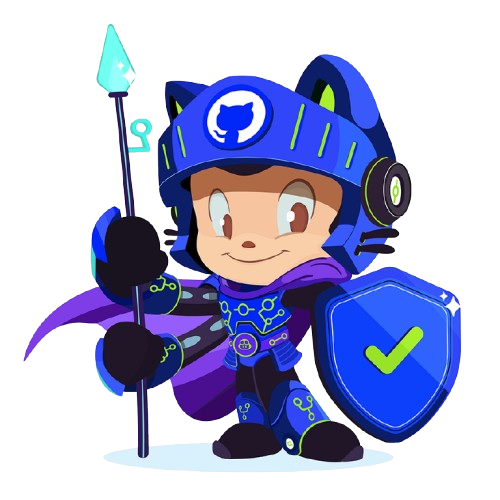

<!-- Top wave -->

<h1 align="center">HEY, I'M Uditha M. Prasad</h1>

👨‍💻 (UG)Software Engineer • Coffee Lover ☕

<!-- Centered table layout -->

<table>
  <tr>
    <td align="center" width="250">
      
    </td>
    <td>

<pre>
<code>
umplk@github
-------------------------------
OS: Arch Linux x86_64
Shell: zsh 5.8
Pronouns: He/Him
WhoAmI: UMP (Uditha M. Prasad)
Location: [Colombo, SriLanka]
Frameworks: React, Node.js, Electron, Tailwind
Languages: HTML, CSS, JS, TS, Python, Php, MySQL
Learning: Software Engineering , CyberSecurity, Web Development
University: Java Institute for Advanced Technology
Hobbies: Coding, Gaming, Music
Email: udithamprasad@gmail.com
Discord: umplk
More Info : https://umplk.github.io
</code>
</pre>

    Don't Chase Approval, Build Your Own Legacy
  
</table>

<!-- Social badges -->

  
  
  

<!-- Bottom wave -->

