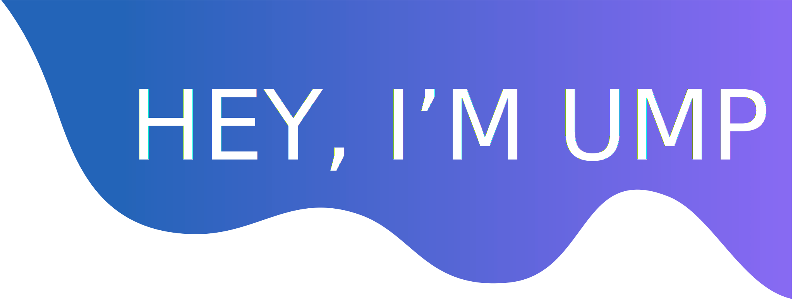
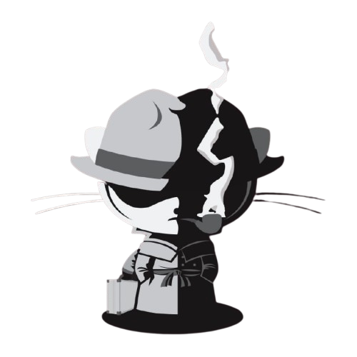

<!-- Top wave SVG -->

<h1 align="center">HEY, I'M [YOUR NAME]</h1>

  <b>I love coding in Python 🐍.</b> 
  I work as a [Your Job Title] and occasionally participate in hackathons.

---

### ⚡ Fun Facts:

- 👯 I’m looking to collaborate on projects that are using Python.
- 🌱 I’m currently learning JavaScript and mathematics required for ML and Data Science.
- 📝 I write blogs on [dev.to](https://dev.to/) on free days.
- 🎵 I love to hear [your favorite genre] music.

---

### ☕ Let's Connect

  
  
  
  <!-- Add more icons as needed -->

<pre>
<code>
[YourGitHubUsername]@github
-------------------------------
OS: Arch Linux x86_64
Shell: zsh 5.8
Pronouns: He/Him
Location: [Your City, Country]
Frameworks: React, Node.js
Languages: Python, JavaScript, TypeScript, HTML, CSS
Learning: Rust, Deno, GraphQL
Hobbies: Gaming, Music, Cooking
Commits: 1234
Stars: 42
Discord: YourDiscordTag#1234
</code>
</pre>

---

  

<!-- Bottom wave SVG -->

